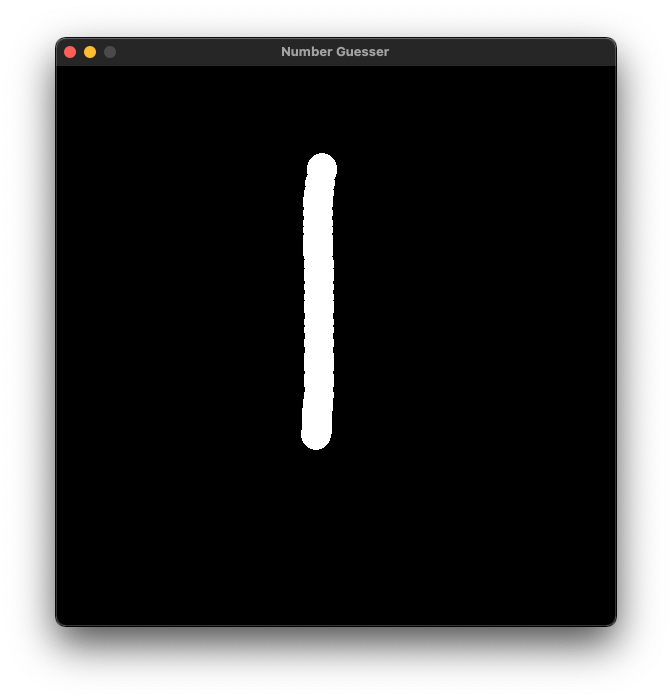
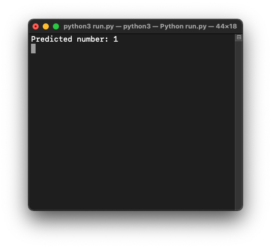
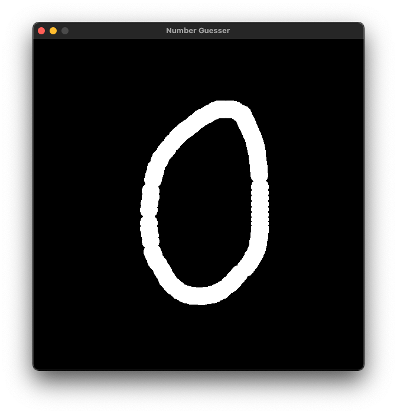
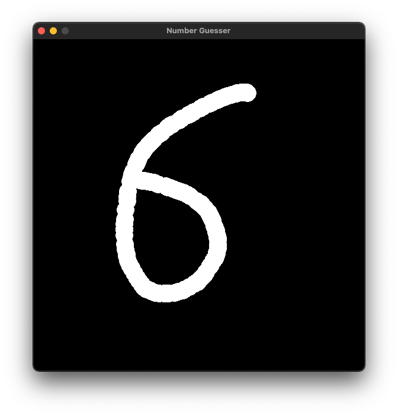
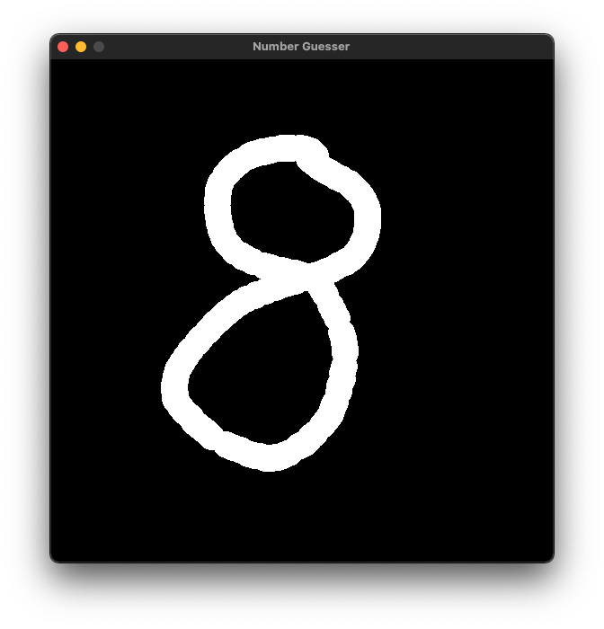

[](https://www.python.org/)
[](https://forthebadge.com)
[](https://forthebadge.com)

[](https://pypi.python.org/pypi/ansicolortags/)

# Number Guessing Game with Tensorflow

Implement neural network using tensorflow with pygame to predict a drawing of number.

## Installation

Use the package manager [pip](https://pip.pypa.io/en/stable/) to install.

```bash
pip install pygame
pip install Pillow
pip install opencv-python
pip install tensorflow

```

## Usage

```python
import pygame
import sys
import os
from PIL import Image
import numpy
import cv2 as cv
import tensorflow as tf
import tensorflow.python.util.deprecation as deprecation
```
## Instructions

Left click to draw

Right click to erase

E to clear board

## Demo

<p align="center">
  
  

  
  

</p>
<p align="center">

  
  

  
  
</p>

## Contributing

Pull requests are welcome. For major changes, please open an issue first to discuss what you would like to change.

Please make sure to update tests as appropriate.

## License
[MIT](https://choosealicense.com/licenses/mit/)
